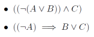

# Well-Formed Formula

**Author:** _Tan Wang Leng_

Checks whether an expression is a well-formed formula.

To run the program:

```
python3 well_formed_formula.py
```

and enter your input accordingly.

## Input

Each line in the input should be an expression that
you want the program to check (see `tutorial1_input.txt` for an example).

Each character in the expression is either one of these (no spaces allowed):

* Propositions: A, B, C, ..., Z
* Unary connectives: ~ (neg)
* Binary connectives: ^ (and), v (or), > (implies), - (iff)
* Parenthesis must be used for composite formulas

For example, the following input:

```
((~(AvB))^C)
((~A)>BvC)
```

Which is equivalent of saying:



And will produce the following output:

```
--------------------
Expression: ((~(AvB))^C)
WELL-FORMED
--------------------
Expression: ((~A)>BvC)
Error: Expected ")" at 7
Error: There were some syntax errors
MALFORMED
```

As stated by the output, the first expression is well-formed. However,
the second expression isn't, because there should be a
closing bracket after the proposition `B`, so it is a
malformed formula.
