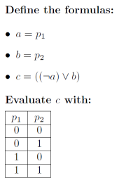

# Evaulate Formula

**Author:** _Tan Wang Leng_

Given well-formed formula(s), evaluate the most-recent
formula given to the program with a set of truth assignment.

To run the program:

```
python3 eval_formula.py
```

and enter your input accordingly.

## Input

The program has three modes:

* Formula definition (`mode def`) to specify all composite formulas.
* Evaulation (`mode eval`) to evaulate the latest composite formula defined, 
  by using the truth assignment passed in.
* End-of-file (`mode end`). Useful if you want to dump unused stuff below.

The program starts with `mode def` as the default mode.

### Definition Mode (`mode def`)

In definition mode, a single line contains the definition
for a composite formula.

Each single character should be a legal keyword (no spaces allowed).
The usable keywords are as follows:

* Composite formula name: `a, b, c, ..., Z`
* Propositions (pnames):` 0, 1, 2, ..., 9`
(note that `0` refers to `p_0`, `1` refers to `p_1`, etc)
* Unary connectives: `~` (neg)
* Binary connectives: `^` (and), `V` (or, beware that it is capital letter), `>` (implies), `-` (iff)
* Parenthesis must be used for composite formulas.

The EBNF form of the input is as follows:

```
<line> ::= <cname> "=" <cform>

<cform> ::= <pname> | <cname> | "(" <unary> <cform> ")" | "(" <cform> <binary> <cform> ")"

<unary> ::= "~"

<binary> ::= "^" | "V" | ">" | "-"

<cname> ::= "a" | "b" | ... | "z"

<pname> ::= "0" | "1" | ... | "9"
```

`<line>` should not have any trailing characters after the `<cform>`, otherwise
it is a syntax error.

#### Implementation Description

The parsing is similar to tutorial 1's well-formed formula parsing, 
where we recursively parse each character found in the EBNF above to
match the EBNF tokens and terminals.

When parsing, an abstract syntax tree (AST) for the composite
formula is generated and stored in the program's memory, which will be
used by the program to get answers during evaluation mode
(by calling `ast.evaluate(defined_cforms, truth_assignment)`).

We allow re-definition of formulas for convenience reasons.

## Evaluation Mode (`mode eval`)

In evaulation mode, a single line contains all of the truth
values. So for example:

```
101000
```

means that `p_1 = 1`, `p_2 = 0`, `p_3 = 1`, `p_4 to p_6 = 0`.

Any other values other than `0` or `1` used will throw a
runtime error.

The truth assignment will be evaluated on the latest
defined formula. An error is thrown if there is no 
recent defined formula.

Defintion mode do not check whether composite formulas
or atomic propositions actually exist, so a runtime
error may be thrown for those (see callers of
`print_eval_error()`) if you use any that does not exist.

#### Implementation Description

As mentioned earlier, the AST's `evaluate(defined_cforms, truth_assignment)` 
method will be used to will traverse down the tree, until we hit `AstPname`
nodes, which we can use the truth assignment to derive an answer, and
propagate it up the tree by applying the operators accordingly.

## Example Input & Output

Given the following input:

```
mode def
a=1
b=2
c=((~a)Vb)
mode eval
00
01
10
11
mode end
```

Which is equivalent of saying:



And the following is the output:

```
Answer (line 6): True
Answer (line 7): True
Answer (line 8): False
Answer (line 9): True
```

Each truth assignment given in `mode eval` is evaluated
using the formula `c=((~a)Vb)`. For Line 6, 
`a=0` and `b=0`, so this evaluates to `True`. Only Line 8 gives
you a `False`, as `a=1` and `b=0` will result in `c=0`.

## Future Work

* During evaluation, answers for composite formula could be cached
  (aka "dynamic programming") if they are used multiple times.
* Short circuiting is not used in the AST's `evaluate()` code for
  code cleanliness sake, but some operations can actually be short-circuited,
  to avoid evaluating the right hand side (this should not be a problem
  for compiled languages that can optimize this away).
